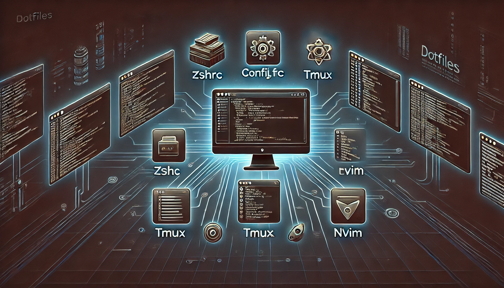

# dotfiles



<div align="center">


</div>

Welcome to my dotfiles repository! Here you'll find all the magical configuration files that make my development environment sparkle. Feel free to explore, use, and laugh at my setup, but remember: with great power comes great responsibility.

> [!WARNING]
>
> Before you dive into the enchanted forest of my dotfiles, a word of caution: **you are responsible** for anything you unleash upon your machine. If your terminal starts spitting out rainbow-colored unicorns or your code editor begins serenading you with lullabies, don't blame me! Everything *should* back up automatically and can (hopefully) revert to its original state, but remember what you parents have taught you-don't trust the random internet wizard with your precious setup!

## Installation

To set up your environment using these dotfiles, clone the repository and run the `install.sh` script:

```shell
git clone --recursive https://github.com/klepp0/dotfiles.git
make install
```

The script will back up your existing dotfiles by renaming them with a `.bak` extension before creating symlinks to the new dotfiles.

### Requirements

- [AeroSpace](https://github.com/nikitabobko/AeroSpace)
- [neovim](https://github.com/neovim/neovim)
- [Oh My Zsh](https://github.com/ohmyzsh/ohmyzsh/)
- [tmux](https://github.com/tmux/tmux)

### Included Dotfiles

- `.zshrc`: Because Zsh is the new Bash.
- `.config/custom-zshrc`: To keep your actual shell configs organised.
- `.config/aerospace/`: The best tiling window manager for MacOS.
- `.config/nvim/`: Checkout my [nvim](https://github.com/klepp0/nvim) repo for more.
- `.config/tmux/`: If you are using nvim without [tmux](https://github.com/tmux/tmux) you are probably doing something wrong.

## Uninstallation

Should you wish to return to the dark ages and remove these delightful dotfiles, run the uninstall.sh script:

```shell
make uninstall
```

This will remove the symlinks and restore your original files from their backups.
